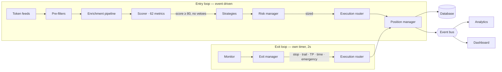
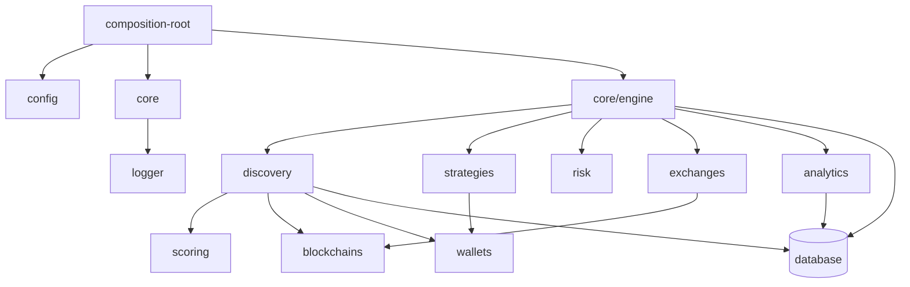
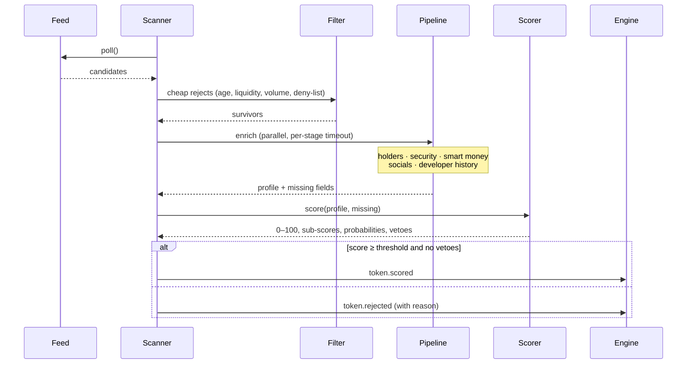
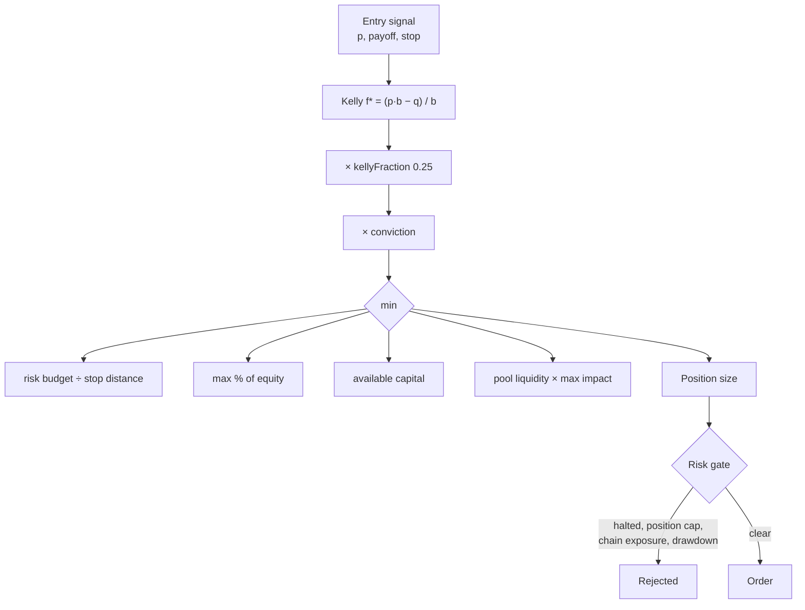
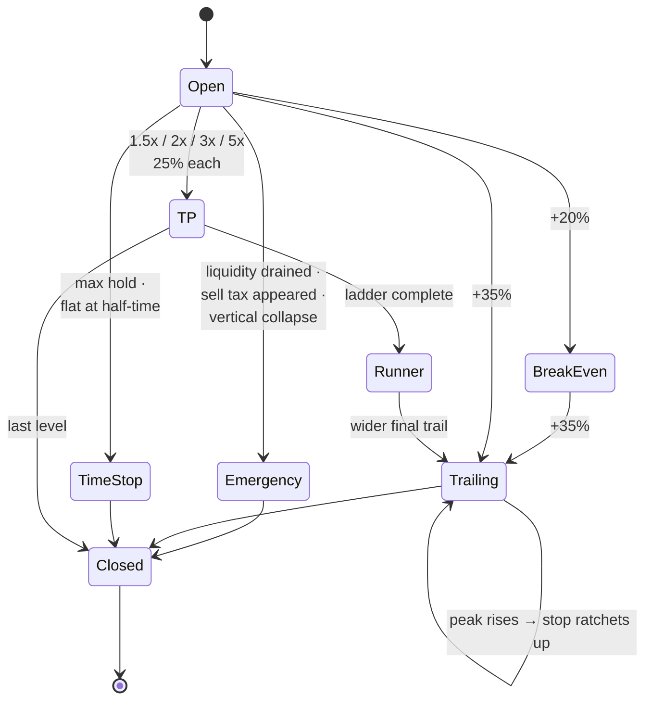
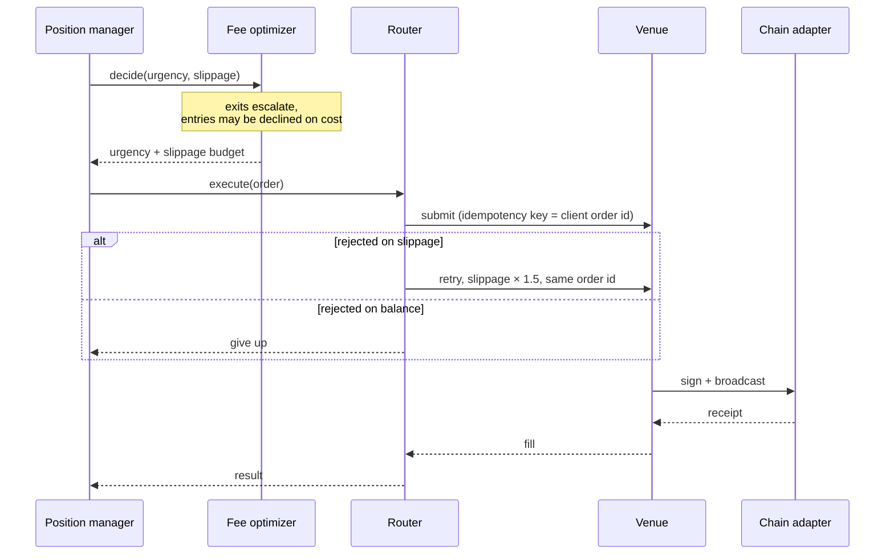
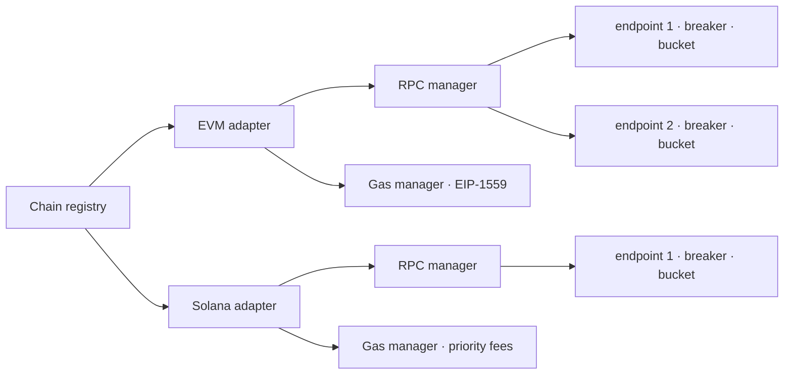

# Architecture

## The shape of the system

Two loops run concurrently and independently.

**Why two loops.** Entries are opportunistic and can wait for the next scan.
Exits cannot. If they shared a cadence, a slow enrichment provider would become
the latency of every stop in the book — the single worst failure mode a bot like
this has. The exit loop therefore runs on its own timer, reads prices from the
scanner's cache with a venue fallback, and is never gated by the risk halt.

---

## Module dependencies

Every arrow crosses an interface, never a concrete class. Modules never import
each other to *react* to something — they publish and subscribe on the event
bus, which is what keeps discovery, strategy, risk and execution independently
testable.

---

## Discovery and scoring

Three decisions carry most of the weight here:

1. **Filters before enrichment.** The pre-filters exist to reject ~95% of a
   feed's firehose using data the feed already gave us, so the expensive stages
   run only on plausible candidates.
2. **Stages degrade, they do not fail.** Each enrichment stage is individually
   timed out; a stage that fails contributes its fields to `missing` rather than
   dropping the token. Losing a token because one social API was slow is worse
   than scoring it with lower confidence.
3. **Missing data is not neutral.** Imputed metrics score at 0.45 — below the
   midpoint — and drag `confidence` down, which tapers the composite. A token we
   know nothing about should not clear an 80 threshold on the strength of what
   we do know.

### Vetoes vs. weights

The scorer separates *penalties* from *disqualifiers*. A live mint authority is
a penalty; a confirmed honeypot is a veto that zeroes the score outright. No
amount of momentum should be able to outvote "this token cannot be sold".

---

## Sizing and risk

Full Kelly is growth-optimal *given exact knowledge* of win rate and payoff. In
memecoin trading both are model estimates, and Kelly is brutally sensitive to an
overstated edge. Three dampers apply in order — fractional Kelly, a hard cap,
and a fixed-risk ceiling — and the fixed-risk ceiling is the binding constraint
in almost every real case. That is what makes "never more than 0.5% of equity
per trade" a guarantee rather than an aspiration.

### Circuit breakers

| Breaker | Catches |
| --- | --- |
| 3 consecutive stops | A regime the strategy no longer fits — the signal still fires, the market changed underneath it. |
| 5% daily drawdown | A single bad session, measured from the day's opening equity rather than the all-time peak. |
| Equity volatility | The case the other two miss: an account not down much yet, but swinging violently. Historically this precedes the drawdown. |

Halts are time-boxed and block **entries only**. Refusing to sell because the
account is in drawdown is how a drawdown becomes a wipeout.

---

## Exits

Precedence is explicit and protective exits win. On a spike-and-reverse candle —
the most common shape in this market — a position that simultaneously crosses a
take-profit level and its trailing stop is closed entirely rather than trimmed
by a quarter.

Stops only ever move up. A stop that widens on an adverse move is not a stop.

---

## Execution

Two properties matter more than they look:

- **The client order id doubles as the idempotency key.** A retry after an
  ambiguous timeout resolves to the same order. A duplicated buy in this market
  is a real, expensive failure.
- **Fills are authoritative.** Entry price, quantity and cost basis come from
  what the venue actually filled, never from what was requested. A position book
  built from intentions drifts out of sync with the wallet within a few trades.

---

## Chain abstraction

Chains are data (`src/config/chains.config.ts`), not code. Adding one means
adding a descriptor; the RPC manager, gas manager, adapters and risk layer are
all driven by `family` and the descriptor fields.

Each RPC endpoint carries its own circuit breaker, token bucket and latency
EWMA, and calls are routed to the fastest healthy endpoint. On Solana in
particular, an endpoint that answers in 900ms instead of 90ms is the difference
between landing an entry and buying the top — so ranking by latency is a
trading decision, not an infrastructure nicety.

---

## Persistence

A single `StorageDriver` port with three implementations:

| Driver | Use |
| --- | --- |
| `memory` | Tests, backtests. |
| `file` | **Default.** Whole dataset in memory, snapshotted atomically to JSON. No native dependencies, survives restarts. |
| `sqlite` | High volume. Rows stored as JSON with indexed `id`/`ts`; arbitrary filters compile to `json_extract`. Optional native dependency, imported lazily. |

Positions are persisted with a full JSON snapshot, so a restart rehydrates open
positions exactly — including trailing state and which take-profit levels have
already executed.

---

## Backtesting

The backtester replays bars in global timestamp order through the *same* scorer,
strategies, sizer and exit engine the live bot uses. Only the venue and the
clock are simulated. A backtester that reimplements the strategy tests the
reimplementation.

Three sources of optimism are modelled explicitly, because omitting any one of
them makes results look better than reality:

1. **Latency** — a signal on bar *n* fills at bar *n+1*'s price.
2. **Impact** — fills pay constant-product slippage against that bar's depth.
3. **Costs** — venue fees and gas on entry and on every exit leg.

Risk limits are enforced inline, so a strategy cannot post results the live risk
manager would never have allowed it to achieve.

---

## Extension points

| To add… | Implement | Register in |
| --- | --- | --- |
| A chain | A `ChainDescriptor` | `config/chains.config.ts` |
| A venue | `ExchangeAdapter` | `composition-root.ts` |
| A data source | `TokenFeed` | `composition-root.ts` |
| An enrichment stage | `Enricher` | `composition-root.ts` |
| A metric | `MetricDefinition` | `scoring/metrics/index.ts` |
| A strategy | `Strategy` (or extend `BaseStrategy`) | `composition-root.ts` |
| A storage backend | `StorageDriver` | `database/database.ts` |

See [EXAMPLES.md](EXAMPLES.md) for worked versions of the last three.
